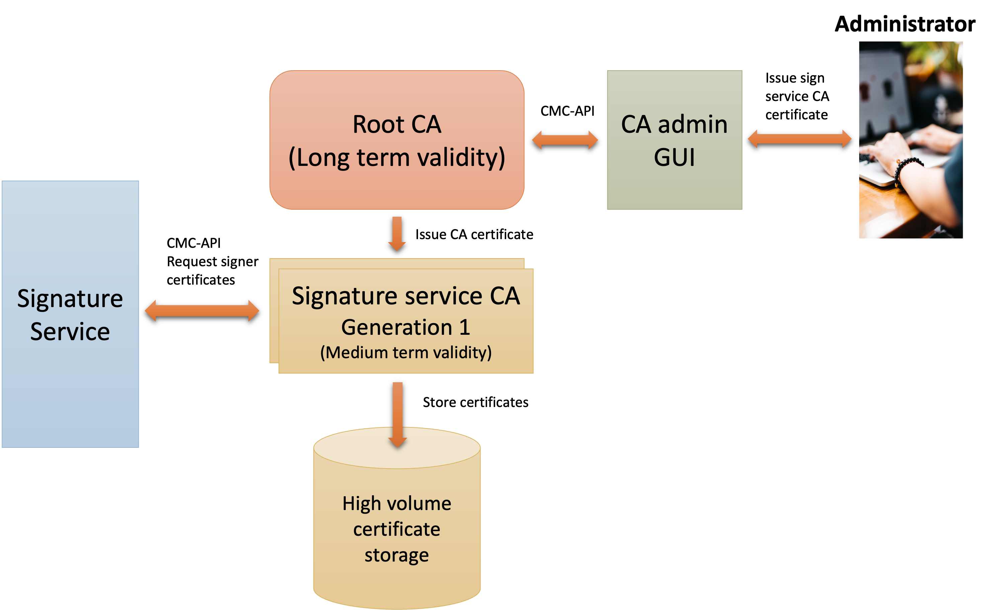

# CA services setup for signature service

The signature service provided by the [Sweden Connect signature service open source](https://github.com/swedenconnect/signservice) use a 
Certification Authority (CA) to issue signer certificates.

The signer certificates are used to assert the identity of the signer and a new signing key and a new signer certificate is generated
everytime a document is signed in the signature service.

## Service architecture

The overall service architecture is illustrated by the following image:

At the center of the CA services infrastructure is the signature service CA that issues certificate on demand as requested by the signature 
service. The signature service CA is designed to be optimized for a number of key conditions:

- High volume of certificates
- Server redundancy
- Speed
- Security

**High volume of certificates**

Some usage of sign service leads to very high volumes of certificate issuance. One major reason behind this is the fact that a new key is 
generated for each instance of signing which then also requires a new certificate for each instance of signing key. When volumes gets high
it also becomes impractical to provide the traditional form of certificate storage where all previously issued certificates is
available for searching and direct access by the CA. And experiences with this type of service also clearly demonstrate that such
direct access is not necessary. Instances of revocation is almost non-existent caused by the fact that no keys can ever be lost or leaked
to an adversary and that a key is only generated as a result of recent secure authentication of the signer.

This signature service CA is therefore designed to only store but never retrieve issued certificates using file storage. A new 
storage file is created each day and old storage files can safely be moved from the CA to secure storage without compromising the operation
of the CA.

**Server redundancy**

The signature service CA is a critical component, and it is therefore important to allow clustered deployment

**Speed**

Signature generation as well as signature validation require quick response times. It is therefore important that high volumes
of traffic and high volume of certificates in storage isn't causing delays in response times.

**Security**

CA services are trust services according to the eIDAS regulation and provider of the proof of signer identity. It is important that
individual components are isolated in a manner that allows them to be protected and audited.

### Service components

The typical service setup for a signature service CA consists of a CA hierarchy where a medium term validity signature CA is certified 
under a long term validity root CA authority. In practical terms this means that the root CA has an expected lifespan of for 20-30 years
while a signature service CA has a typical lifespan of 5-10 years, issuing signature certificates with a typical lifespan of 1 year.

This setup allows signature service CA keys to be rotated under the common root without affecting Relying Party (RP) application's trust 
configuration.

While the signature service CA operates without human interaction, as it only issues certificates from requests by the signature service,
the root CA on the other hand is operated by administrators, manually using the root CA to issue certificates for the signature service
CA instances. The root CA is therefore setup as a frontend / backend service where the administrator logs into the frontend service
providing an admin GUI and use that to send a request to the backend root CA to issue a CA certificate.

Both CA services use the CMC protocol (RFC 5272) with signed requests and responses over https to secure and authenticate certificate 
issuance requests and responses.

In summary the signature services CA architecture requires at least the following 3 service components:

| Component      | Description                                                              | Source code                                                                                        |
|----------------|--------------------------------------------------------------------------|----------------------------------------------------------------------------------------------------|
| ca-cmc-admin   | The administration frontend application of the signature service root CA | [https://github.com/swedenconnect/ca-cmc-admin](https://github.com/swedenconnect/ca-cmc-admin)     |
| ca-headless    | The backend CA service of the signature service root CA                  | [https://github.com/swedenconnect/ca-headless](https://github.com/swedenconnect/ca-headless)       |
| ca-signservice | The backend CA service of the signature service CA                       | [https://github.com/swedenconnect/ca-signservice](https://github.com/swedenconnect/ca-signservice) |

## Deployment strategy

For deployment strategy and configuration of each of the service components, please consult README.md of each source repository. 

